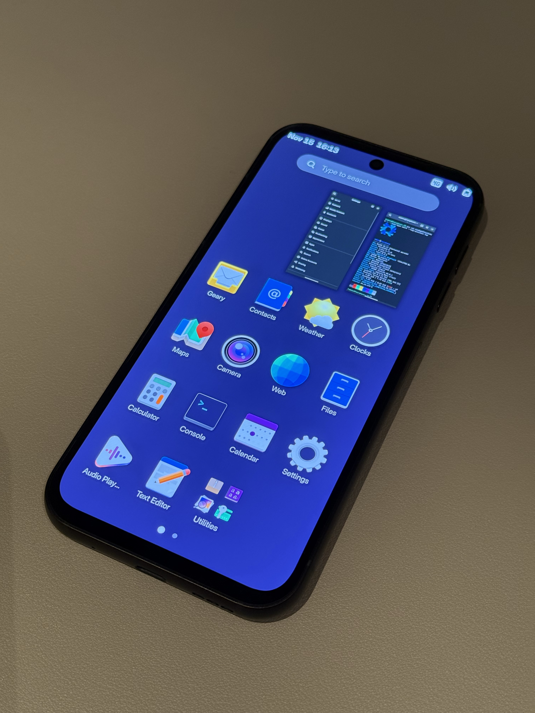
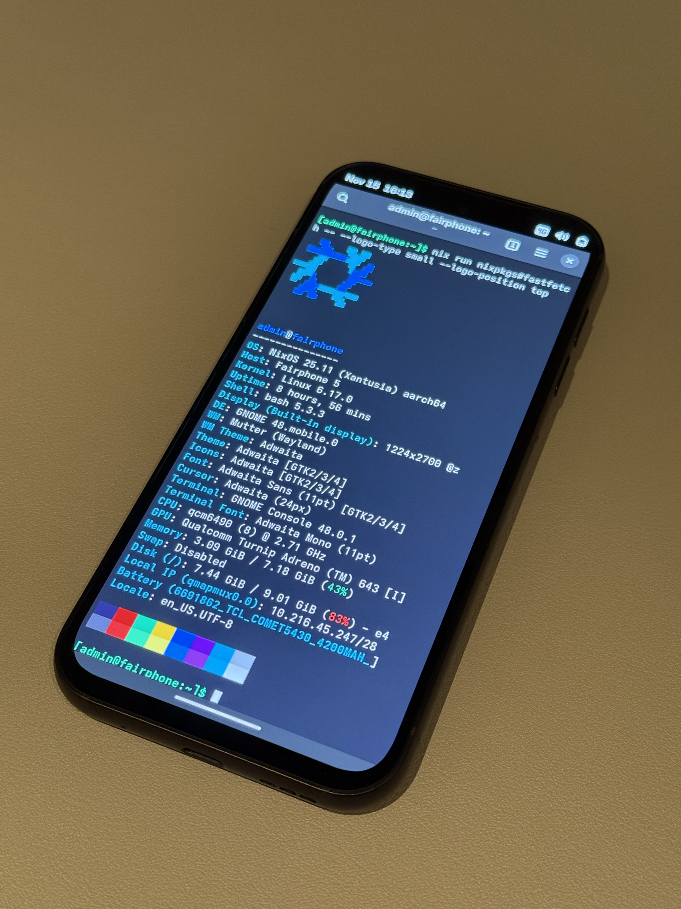

# NixOS on Fairphone 5

This repository aims to port NixOS to the Fairphone 5, a modular and sustainable smartphone. The goal is to provide a fully functional NixOS system that can run on the Fairphone 5, and to support as many of its hardware features as possible.

The Fairphone 5 uses a Qualcomm QCM6490 SoC, which is based on the ARM architecture and is very similar to the Qualcomm SC7280 SoC found in various other devices. This repository builds on existing work by the amazing PostmarketOS community, mainly their work on porting the Linux kernel and other essential components to the Fairphone 5. For more information regarding the status of the port, see the [Fairphone 5 page](<https://wiki.postmarketos.org/wiki/Fairphone_5_(fairphone-fp5)>) in the PostmarketOS Wiki.

<div align="center">
   
   
</div>

## Current Status

- Kernel: 6.17.0

### Supported Hardware

- Audio: Not tested yet
- Battery: Works
- Camera: Selfie and wide-angle cameras work (quality is not amazing)
- Cellular modem: Works
- Screen: Works
- Touchscreen: Works
- Wi-Fi: Works

Additional details will be added here as development progresses.

Note: Hardware was tested using the GNOME Mobile builds. When using the minimal images, the device boots up and the screen works, but the device has to be controlled remotely over USB Serial or SSH, because there is no virtual keyboard (and thus no way to log in on the device itself).

## Getting Started

> [!CAUTION]
> Cross-compilation is currently not supported, so you need to build the images on an `aarch64-linux` NixOS host. However, because Nix has excellent support for remote builders, you can also delegate the build to a remote aarch64 builder (more info can be found further down below).

**Prerequisites:**

- A Fairphone 5 device, obviously :)
- The device must have an unlocked bootloader. Follow the instructions on the [Fairphone 5 page](<https://wiki.postmarketos.org/wiki/Fairphone_5_(fairphone-fp5)>) in the PostmarketOS Wiki if you haven't done this yet.
- An `aarch64-linux` NixOS host to build the images. Other distributions that have Nix installed may also work, but have not been tested. Alternatively, you can use a remote builder from any Nix-enabled system.

**Optional: Set up Remote Builder**

I recommend using [nixbuild.net](https://nixbuild.net) as a remote builder. It's pretty easy to set up, works well in my testing, and they provide the necessary `aarch64-linux` builders. The builds of each derivation are even cached, so subsequent builds are usually pretty fast!

First, set up an account, add your SSH public key to the service as described in their [getting started guide](https://docs.nixbuild.net/getting-started/#getting-started). Note: You don't need to set their server as a builder for your entire NixOS configuration as described in their guide (section "Quick NixOS Configuration"); you can simply set the `programs.ssh.extraConfig` and `programs.ssh.knownHosts` options in your config as described in their guide, and ignore the `nix.distributedBuilds` and `nix.buildMachines` options. This way, you can use the remote builder on-demand as needed.

Verify whether you are able to connect to their server via SSH:

```sh
sudo ssh eu.nixbuild.net shell
```

If you're able to connect, you're ready to use the remote builder to build your images.

### Add Module to your NixOS Configuration

If you want to use NixOS your own Fairphone 5, the images built from the example configurations provided in this repository will probably not be sufficient. Instead, you can add the Fairphone 5 module to your own `flake.nix` and build your own images like this:

```nix
{
  inputs = {
    nixpkgs.url = "github:NixOS/nixpkgs/nixos-unstable";
    nixos-fairphone-fp5.url = "github:gian-reto/nixos-fairphone-fp5";
  };

  outputs = { self, nixpkgs, nixos-fairphone-fp5, ... }: {
   nixosConfigurations.my-fairphone = nixpkgs.lib.nixosSystem {
      system = "aarch64-linux";
      modules = [
        # Import the Fairphone 5 NixOS module.
        nixos-fairphone-fp5.nixosModules.default

        # Import your own custom configuration.
        ./hosts/my-fairphone/default.nix
      ];
    };

    # Use the `mkBootImage` and `mkRootfsImage` functions provided by this flake to be able to build
    # boot and rootfs images from your custom configuration, so you can easily flash the first
    # generation of your configuration to your Fairphone 5 using `fastboot`.
    packages.aarch64-linux =
      let
        pkgs = nixpkgs.legacyPackages.aarch64-linux;
      in {
        boot-image = nixos-fairphone-fp5.lib.mkBootImage
          self.nixosConfigurations.my-fairphone
          pkgs;

        rootfs-image = nixos-fairphone-fp5.lib.mkRootfsImage
          self.nixosConfigurations.my-fairphone
          pkgs;

        # Alternatively, if you use Home Manager, use `mkRootfsImageWithHomeManager` to build the
        # rootfs image including Home Manager configuration instead of `mkRootfsImage`:
        #
        # rootfs-image = nixos-fairphone-fp5.lib.mkRootfsImageWithHomeManager
        #   self.nixosConfigurations.my-fairphone
        #   pkgs;
      };
  };
}
```

> [!TIP]
> If you use remote builders, I recommend configuring Nix to always use remote builders by default on your Fairphone. This way, you don't have to rebuild locally on your phone if you do a `nixos-rebuild switch` on the device itself. Otherwise, builds might take a very long time or even fail due to insufficient resources (I have not even dared to try yet, so I'm not sure what happens!).

### Build and Flash Images

1. Put your device into `fastboot` mode by turning it off first, and then holding the volume down and power button simultaneously until the device powers on and displays the `fastboot` screen.
2. Connect the Fairphone 5 to your host machine via USB-C.

If you added the image packages as shown above, you can simply build the images using the following commands:

3. Build the boot image (locally on an `aarch64-linux` host):

```sh
nix build .#packages.aarch64-linux.boot-image
```

Or in case you want to use nixbuild.net as a remote builder, the command is slightly different:

```sh
nix build .#packages.aarch64-linux.boot-image --max-jobs 0 --builders "ssh://eu.nixbuild.net aarch64-linux - 100 1 big-parallel,benchmark" --option builders-use-substitutes true
```

4. The previous command should output a symlink called `result`, which points to the boot image you just built. You can flash the image to the phone's boot partition as follows:

```sh
nix shell nixpkgs#android-tools -c fastboot flash boot result
```

5. Build the rootfs image (locally on an `aarch64-linux` host):

```sh
nix build .#packages.aarch64-linux.rootfs-image
```

Or in case you want to use nixbuild.net as a remote builder:

```sh
nix build .#packages.aarch64-linux.rootfs-image --max-jobs 0 --builders "ssh://eu.nixbuild.net aarch64-linux - 100 1 big-parallel,benchmark" --option builders-use-substitutes true
```

6. The previous command should again output a symlink called `result` (in fact, it overrides the existing symlink if you built the boot image before, so always make sure you have built the correct image before you flash!), which points to the rootfs image you just built. You can flash the image to the phone's userdata partition as follows:

```sh
nix shell nixpkgs#android-tools -c fastboot flash userdata result
```

7. Now that both images are flashed, you can reboot the device:

```sh
nix shell nixpkgs#android-tools -c fastboot reboot
```

Just wait until the device has fully booted, which could take a while. You should then be greeted by the login prompt or screen of your NixOS system!

> [!IMPORTANT]
> When booting NixOS, the display will show various artifacts, and the screen will be black for a brief moment. This is expected behavior and doesn't mean something is wrong. Just wait a bit until the device has fully booted and the login prompt or screen appears.

## Advanced Usage

In some advanced use cases, you might want to change the process of building the images, or do other customizations. In that case, you can use the `fairphone-fp5` overlay provided by this flake directly, which allows you to use the included packages in the way you want.

```nix
{
  inputs.nixos-fairphone-fp5.url = "github:gian-reto/nixos-fairphone-fp5";

  outputs = { nixpkgs, nixos-fairphone-fp5, ... }: {
    nixosConfigurations.my-fairphone = nixpkgs.lib.nixosSystem {
      system = "aarch64-linux";
      modules = [
        {
          nixpkgs.overlays = [ nixos-fairphone-fp5.overlays.default ];

          # Now you have access to all Fairphone packages:
          # pkgs.kernel-fairphone-fp5
          # pkgs.firmware-fairphone-fp5
          # pkgs.pd-mapper, pkgs.qrtr, pkgs.rmtfs, etc.
        }
        # Your custom configuration...
      ];
    };
  };
}
```

## Development & Contribution

This flake outputs packages for building boot and rootfs images for the two example host configurations in `./hosts`. These can be built on their own and flashed to a Fairphone 5 as described in the "Getting Started" section above. By default, the user is called "admin", and the password is "admin" as well.

At the moment, the development process is mostly done by changing code, building new images, and then testing them on the device. This can be quite tedious, as the build times are relatively long (even with a remote builder), but for now this is the best way to make sure everything works as expected on the actual hardware.

### AI

The development in this repository is partially assisted by AI tools. Contributions made with the help of AI are welcome, provided that they are reviewed and tested by human contributors to ensure quality and correctness.

Coding agents must adhere to the instructions and guidelines outlined in [AGENTS.md](AGENTS.md) when working in this repository.

## Thanks

- Huge thanks to the PostmarketOS community for their incredible work on porting Linux to the Fairphone 5 (especially to Luca Weiss, the main maintainer of the Fairphone ports) and other devices. Their efforts have laid the groundwork for this NixOS port, and their documentation and resources have been invaluable throughout the development process.
- This port was also inspired by [MatthewCroughan/nixos-qcm6490](https://github.com/MatthewCroughan/nixos-qcm6490), which is an attempt to port NixOS to the SHIFTphone 8 (otter), which uses the same SoC as the Fairphone 5. Not sure if the port was successful, but the code was still an invaluable reference. Thanks, Matthew!
- [chuangzhu/nixpkgs-gnome-mobile](https://github.com/chuangzhu/nixpkgs-gnome-mobile) was an invaluable resource for getting GNOME Mobile to work on NixOS.
